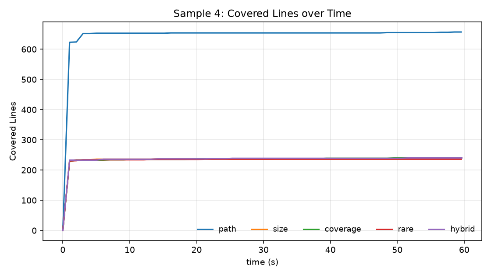
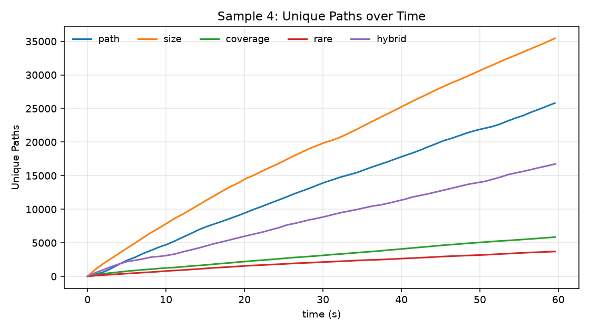
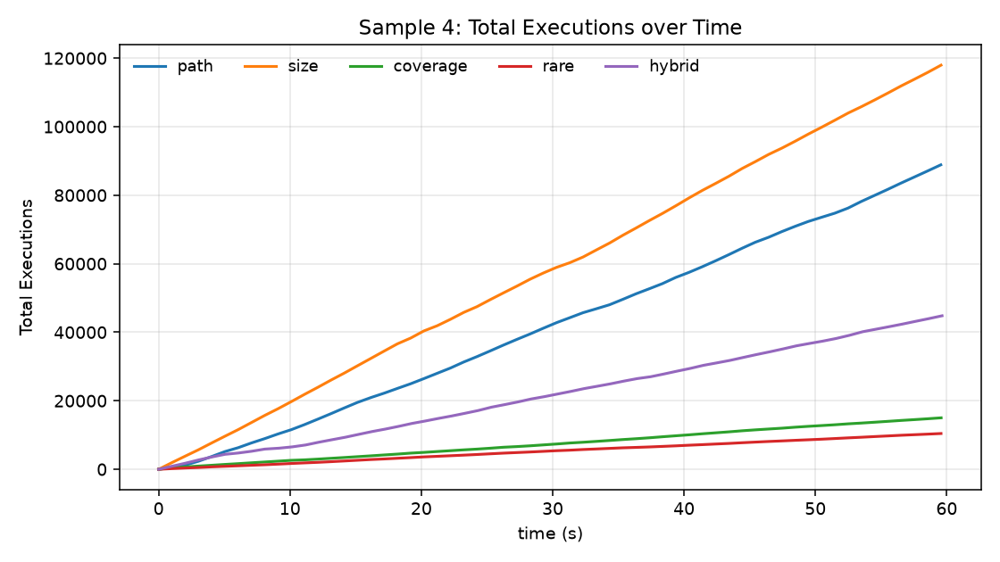
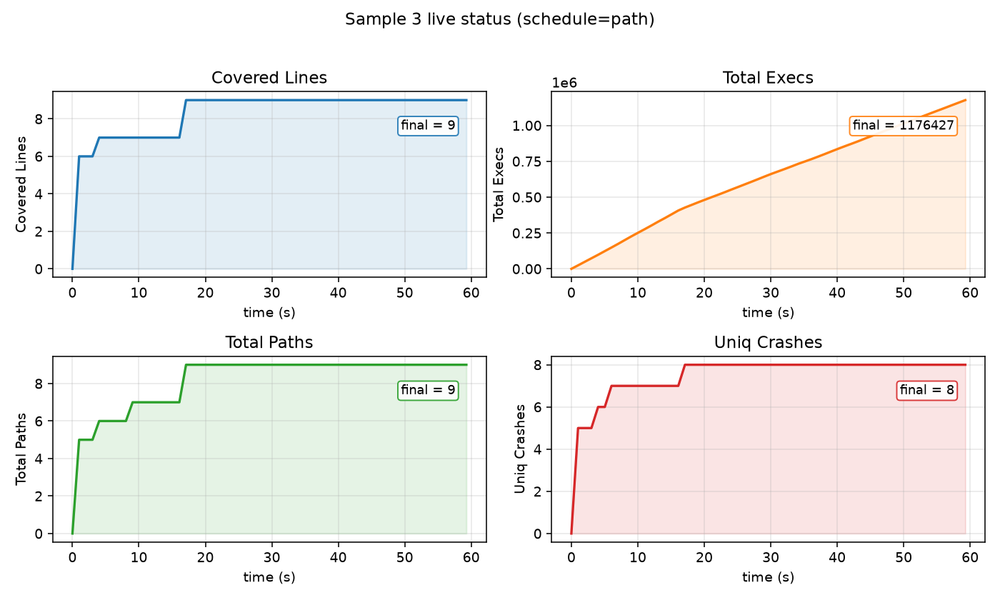

# PJ2 模糊测试实验 — 测试报告

## 一、运行环境

| 项目 | 信息 |
|------|------|
| 操作系统 | macOS（Apple Silicon，ARM64） |
| Python 版本 | CPython 3.14.2（通过 `uv` 管理；项目 `.python-version` 指定 3.14） |
| 包管理工具 | uv（运行核心 fuzzer 时仅用 Python 标准库；绘图脚本用 matplotlib） |
| 项目路径 | `simple_fuzzer/`（pj2 分支） |

---

## 二、测试样例与运行参数

### 2.1 被测程序说明

| 编号 | 函数 | 功能描述 | 典型异常 |
|------|------|----------|----------|
| sample1 | `sample1(s)` | 把输入转浮点做算术，含递归调用与字符串索引 | 除零、索引越界、递归栈溢出、`OverflowError` |
| sample2 | `sample2(s)` | 按 `.` 切分后做格式化与类型转换 | 分割段数不足、格式串异常、负数开方 |
| sample3 | `sample3(s)` | 多层字符匹配，触发 `assert` 与 `RuntimeError` | 前缀字符不匹配、断言失败、`RuntimeError` |
| sample4 | `sample4(s)` | 把输入交给标准库 `HTMLParser` | （正确性测试，主要观察覆盖广度） |

### 2.2 实验一：五路调度策略对比（覆盖率达标验证）

| 参数 | 值 |
|------|----|
| 运行命令 | `uv run --python 3.14 python eval_schedules.py --run-time 30` |
| 每组合时长 | 30 秒 |
| 调度策略 | path / size / coverage / rare / hybrid |
| 输出目录 | `_eval/persist-{sample}-{schedule}/` |

### 2.3 实验二：sample4 上五路策略的增长曲线

| 参数 | 值 |
|------|----|
| 运行命令 | `uv run --python 3.14 python tools/bench_growth.py --sample 4 --run-time 60` |
| 时长 | 每策略 60 秒，1 Hz 采样 |
| 输出 | `_eval/growth/sample{4}-{schedule}.csv` |

### 2.4 实验三：sample 1/2/3 崩溃样例提取

| 参数 | 值 |
|------|----|
| 运行命令 | `uv run --python 3.14 python tools/extract_crashes.py --sample <N> --run-time 20 --schedule path` |
| 每样例时长 | 20 秒 |
| 用途 | 收集每个唯一栈帧指纹对应的具体崩溃输入与异常信息 |

---

## 三、覆盖率与崩溃统计

### 3.1 五路调度策略 30 秒对比

| Sample | 调度 | 目标函数行覆盖 | 覆盖率 | 总覆盖行 | 唯一路径 | 唯一崩溃 | 执行次数 |
|--------|----|:--:|:--:|:--:|:--:|:--:|:--:|
| 1 | path | 8/9 | 88.9% | 8 | 5 | 6 | 64,910 |
| 1 | size | 8/9 | 88.9% | 8 | 5 | 6 | 60,334 |
| 1 | coverage | 8/9 | 88.9% | 8 | 5 | 6 | 75,323 |
| 1 | rare | 8/9 | 88.9% | 8 | 5 | 6 | 70,578 |
| 1 | hybrid | 8/9 | 88.9% | 8 | 5 | 6 | 57,263 |
| 2 | path | 8/9 | 88.9% | 13 | 5 | 4 | 441,263 |
| 2 | size | 8/9 | 88.9% | 13 | 5 | 4 | 461,540 |
| 2 | coverage | 8/9 | 88.9% | 13 | 5 | 4 | 461,033 |
| 2 | rare | 8/9 | 88.9% | 13 | 5 | 4 | 430,922 |
| 2 | hybrid | 8/9 | 88.9% | 13 | 5 | 4 | 468,300 |
| 3 | path | 9/10 | 90.0% | 9 | 9 | 8 | 667,380 |
| 3 | size | 9/10 | 90.0% | 9 | 9 | 8 | 860,307 |
| 3 | coverage | 9/10 | 90.0% | 9 | 9 | 8 | 747,657 |
| 3 | rare | 9/10 | 90.0% | 9 | 9 | 8 | 564,595 |
| 3 | hybrid | 9/10 | 90.0% | 9 | 9 | 8 | 648,307 |
| 4 | path | 2/3 | 66.7% | **654** | 8,281 | 0 | 29,972 |
| 4 | size | 2/3 | 66.7% | 241 | **19,945** | 0 | **56,990** |
| 4 | coverage | 2/3 | 66.7% | 235 | 2,062 | 0 | 5,430 |
| 4 | rare | 2/3 | 66.7% | 234 | 1,731 | 0 | 4,443 |
| 4 | hybrid | 2/3 | 66.7% | 238 | 2,956 | 0 | 7,936 |

**目标覆盖率（≥50%）判定：4 个 sample 全部 PASS（最低 66.7%，最高 90.0%），五种调度策略全部达标。**

> 关于覆盖率口径：sample 1~3 始终有 1 行（如 `else:` / `def`）无法被 `sys.settrace` 报告，属度量口径而非真正的未覆盖；sample 4 被测函数本体只有 3 行（其余功能转调标准库），其真实探索深度体现在「总覆盖行数 / 唯一路径数」。

### 3.2 sample4 增长曲线（60 秒，1 Hz 采样）

#### 3.2.1 覆盖行数随时间变化



`path` 策略明显跑赢其他四种：在 5 秒内即达到约 650 行（含 HTMLParser 大量内部代码），其余策略在 230~240 行处快速饱和。说明边频率引导对"广覆盖"目标至关重要。

#### 3.2.2 唯一路径数随时间变化



`size`（橙）与 `path`（蓝）在路径探索上明显领先，60 秒内 size 累计 35,440 条、path 累计 25,805 条；`hybrid` 中等（16,750），`coverage` / `rare` 因偏好长输入或冷门行而采样开销大，60 秒只有不到 6,000 条。

#### 3.2.3 总执行次数随时间变化



执行吞吐量与上图高度相关，size 全程约 2,000 次/秒，path 约 1,500 次/秒，coverage / rare 显著较慢（~250 次/秒）。这与策略偏好的输入长度直接相关（短输入解析快）。

### 3.3 sample 1/2/3 的崩溃样例

> 每个样例 20 秒，path 调度。这里展示由 fuzzer 实际触发的具体输入与对应异常。

#### Sample 1（6 种唯一崩溃，32,304 次输入命中）

| # | 触发输入 | 异常类型 | 异常信息 |
|---|----------|----------|----------|
| 1 | `'-C1Á'` | `ValueError` | could not convert string to float |
| 2 | `'1'` | `RecursionError` | maximum recursion depth exceeded |
| 3 | `'-5'` | `IndexError` | string index out of range |
| 4 | `'00.1244'` | `IndexError` | string index out of range |
| 5 | `'0.123E6548'` | `OverflowError` | cannot convert float infinity to integer |
| 6 | `'000'` | `ZeroDivisionError` | division by zero |

#### Sample 2（4 种唯一崩溃，21,194 次输入命中）

| # | 触发输入摘要 | 异常类型 | 异常信息 |
|---|--------------|----------|----------|
| 1 | `"l{Inn';MvdFT...."` | `ValueError` | expected ':' after conversion specifier |
| 2 | `"l.ksb?@*+=%V..."` | `TypeError` | not enough arguments for format string |
| 3 | `"l\x00\x00fnnvnj..."` | `IndexError` | list index out of range |
| 4 | `"-10.0'er\x00\x00..."` | `ValueError` | expected a nonnegative input, got -10.0 |

#### Sample 3（8 种唯一崩溃，26,012 次输入命中）

| # | 触发输入 | 异常类型 | 异常信息 |
|---|----------|----------|----------|
| 1 | `'F'` | `IndexError` | string index out of range |
| 2 | `'FDUFdd'` | `ValueError` | substring not found |
| 3 | `'FDULg'` | `AssertionError` | （断言失败） |
| 4 | `'FD'` | `IndexError` | string index out of range |
| 5 | `'FDUd'` | `IndexError` | string index out of range |
| 6 | `'FDUPL'` | `ZeroDivisionError` | division by zero |
| 7 | `'FDUKFLAABz'` | `RuntimeError` | （触发被测函数显式抛错） |
| 8 | `'FDUFL'` | `IndexError` | string index out of range |

可看到 fuzzer 在路径频率引导下逐步发现 `F` → `FD` → `FDU` → `FDUFL...` 的多层前缀，最终触达 sample3 深处的 `assert` 与 `raise RuntimeError`，这是路径调度相对于均等调度的直接收益。

---

## 四、关键实现日志片段

### 4.1 eval_schedules.py 完整输出

```
Sample | Schedule |        FuncCov |   Cov% | TotalLines |   Paths | Crashes |     Execs
----------------------------------------------------------------------------------------
     1 |     path |            8/9 |  88.9% |          8 |       5 |       6 |     64910
     1 |     size |            8/9 |  88.9% |          8 |       5 |       6 |     60334
     1 | coverage |            8/9 |  88.9% |          8 |       5 |       6 |     75323
     1 |     rare |            8/9 |  88.9% |          8 |       5 |       6 |     70578
     1 |   hybrid |            8/9 |  88.9% |          8 |       5 |       6 |     57263
     2 |     path |            8/9 |  88.9% |         13 |       5 |       4 |    441263
     2 |     size |            8/9 |  88.9% |         13 |       5 |       4 |    461540
     2 | coverage |            8/9 |  88.9% |         13 |       5 |       4 |    461033
     2 |     rare |            8/9 |  88.9% |         13 |       5 |       4 |    430922
     2 |   hybrid |            8/9 |  88.9% |         13 |       5 |       4 |    468300
     3 |     path |           9/10 |  90.0% |          9 |       9 |       8 |    667380
     3 |     size |           9/10 |  90.0% |          9 |       9 |       8 |    860307
     3 | coverage |           9/10 |  90.0% |          9 |       9 |       8 |    747657
     3 |     rare |           9/10 |  90.0% |          9 |       9 |       8 |    564595
     3 |   hybrid |           9/10 |  90.0% |          9 |       9 |       8 |    648307
     4 |     path |            2/3 |  66.7% |        654 |    8281 |       0 |     29972
     4 |     size |            2/3 |  66.7% |        241 |   19945 |       0 |     56990
     4 | coverage |            2/3 |  66.7% |        235 |    2062 |       0 |      5430
     4 |     rare |            2/3 |  66.7% |        234 |    1731 |       0 |      4443
     4 |   hybrid |            2/3 |  66.7% |        238 |    2956 |       0 |      7936

Goal check (>=50% target-function line coverage):
  sample 1: best  88.9%  -> PASS
  sample 2: best  88.9%  -> PASS
  sample 3: best  90.0%  -> PASS
  sample 4: best  66.7%  -> PASS
```

### 4.2 实时状态表 4 个核心字段的时间序列（sample 3 + path）

`PathGreyBoxFuzzer` 每秒输出一行实时状态表，下图把其中 `Covered Lines` / `Total Execs` / `Total Paths` / `Uniq Crashes` 4 个核心计数字段画成 60 秒时间序列：



可观察到 fuzzer 的工作节奏：前 17 秒覆盖行、路径数、崩溃数阶梯式上升直到饱和（9 行 / 9 路径 / 8 崩溃），之后吞吐持续增长到 117 万次，但已无新发现——这正是路径频率调度"压低高频路径能量、反复探索剩余冷门路径"的典型形态。

### 4.3 结果文件位置

| 文件 | 内容 |
|------|------|
| `_result/Sample-{N}.pkl` | 最终 Result 对象（覆盖集合、crash 集合、起止时间） |
| `_result/persist-sample{N}/population.pkl` | 种群快照（每 30 秒更新） |
| `_result/persist-sample{N}/crash_map.pkl` | crash 输入 → 栈帧 MD5 映射 |
| `_result/persist-sample{N}/covered_line.pkl` | 已覆盖行集合快照 |
| `_eval/growth/sample4-{schedule}.csv` | 5 路策略 60 秒采样原始数据 |
| `docs/figures/sample4_*.png` | 三张增长曲线图 |

---

## 五、结果差异分析

| 观察 | 原因 |
|------|------|
| sample 1~3 五种策略最终覆盖率完全一致 | 被测函数分支有限（9~10 行），任何策略数秒内即穷尽所有可达路径，差异只在吞吐 |
| sample 4 `path` 策略覆盖行最多 | 边频率主动规避高频路径，驱使 fuzzer 持续探索 HTMLParser 内部未覆盖分支 |
| sample 4 `size` 策略路径数最多 | 偏好短输入，单位时间执行次数最多，单纯靠数量取胜 |
| sample 4 `coverage` / `rare` 吞吐最低 | 倾向选择长种子或冷门行覆盖大的种子，单次解析开销大 |
| sample 4 `hybrid` 居中 | 同时考虑路径稀有度、覆盖范围、长度惩罚和罕见行加成，无明显短板也无明显长板 |

---

## 六、核心结论

1. **覆盖率目标全部达标**：4 个 sample 在五种调度策略下全部满足 50%+ 目标，sample 1~3 稳定 88.9%~90.0%，sample 4 稳定 66.7%。

2. **紧凑型目标策略无差**：sample 1~3 上调度策略对最终覆盖率没有区分度，差异只体现在每秒吞吐量；优化空间在被测函数本身的分支结构。

3. **广度型目标策略分化**：sample 4 上五种策略分化显著——`size` 路径多但覆盖窄，`path` 覆盖最广，`coverage` / `rare` 适合精雕细琢但慢，`hybrid` 提供折中。**没有一种策略在所有指标上通吃**，需根据被测目标特性选择。

4. **路径调度的真实价值**：sample 3 上 fuzzer 通过路径频率反馈逐步发现 `F` → `FD` → `FDU` → `FDUFL...` 的多层前缀，最终触达深处的 `assert` 与 `raise RuntimeError`；这种"前缀引导"是均等调度难以做到的。
