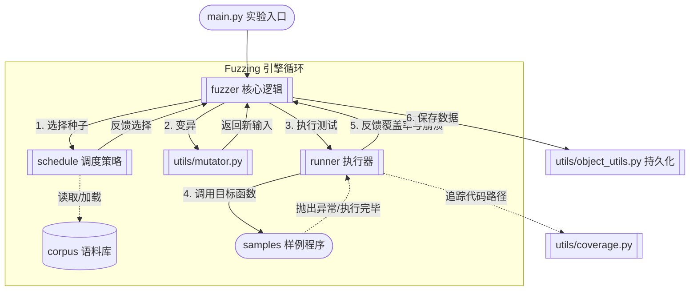

# simple_fuzzer 项目说明

`simple_fuzzer` 是一个面向课程实验的简易灰盒模糊测试框架。它以 Python 函数作为被测目标，通过语料库种子、输入变异、覆盖率采集和调度策略，演示一个完整但轻量的 fuzzing 流程。

## 项目结构

```text
simple_fuzzer/
├── main.py                  # 实验入口，负责选择样例、加载语料库并启动 fuzzing
├── corpus/                  # 初始种子数据
├── fuzzer/                  # Fuzzer 核心逻辑
├── runner/                  # 目标程序执行器与覆盖率采集
├── samples/                 # 4 个示例被测程序
├── schedule/                # Seed 调度策略
└── utils/                   # 覆盖率、变异、对象持久化等基础工具
```

### `fuzzer/`
- `fuzzer.py`：Fuzzer 基类，定义 `fuzz`、`run`、`runs` 的统一流程。
- `grey_box_fuzzer.py`：灰盒 fuzz 的基础实现，负责种子管理、变异与覆盖率/崩溃统计。
- `path_grey_box_fuzzer.py`：基于路径频率的灰盒 Fuzzer 扩展，用于配合路径调度策略。

### `runner/`
- `runner.py`：执行器基类。
- `function_coverage_runner.py`：将字符串输入喂给 Python 函数，并记录运行期间的覆盖率与异常。

### `schedule/`
- `power_schedule.py`：基础能量调度策略（均等能量 + 加权随机选择）。
- `path_power_schedule.py`：按路径频率分配能量的调度策略（路径越罕见，能量越高）。
- `size_power_schedule.py`：按输入长度分配能量（输入越短，能量越高）。
- `coverage_power_schedule.py`：按单次覆盖范围分配能量（覆盖行数越多，能量越高）。
- `rare_line_power_schedule.py`：按罕见代码行覆盖情况分配能量（命中冷门行越多，能量越高）。
- `hybrid_power_schedule.py`：融合调度（路径稀有度 × 覆盖范围 × 长度惩罚 × 罕见行加成）。

### `samples/`
- 提供 4 个示例程序，覆盖数值处理、字符串解析、分支嵌套和 HTML 解析等典型场景。

### `corpus/`
- 保存每个样例对应的初始语料库种子。

### `utils/`
- `coverage.py`：覆盖率追踪。
- `seed.py`：种子对象。
- `mutator.py`：输入变异算子集合（9 种变异策略）。
- `object_utils.py`：对象序列化、反序列化与哈希工具。

## 建议使用 uv 管理环境

> 什么？还在用 conda 或 venv？快来试试 uv 吧！`uv` 是一个现代化的 Python 包管理工具，提供了更快的依赖安装和更简洁的环境管理方式。

本项目本身主要依赖 Python 标准库，推荐使用 `uv` 来创建隔离环境并运行实验。

请阅读 [uv 官方文档](https://docs.astral.sh/uv/) 来了解如何安装和使用 uv。

本项目没有 `pyproject.toml`，使用 `.python-version` 锁定 Python 3.14，依赖标准库，所以不需要 `uv sync`。直接用 `uv run` 即可，首次运行会自动安装对应版本的 Python：

```bash
uv run --python 3.14 python main.py --sample 4 --run-time 300
```

如果你希望切换被测样例，可以修改 `--sample` 参数，取值范围为 `1` 到 `4`。

## 运行说明

```bash
# 默认调度（路径频率）
uv run --python 3.14 python main.py --sample 1 --run-time 60

# 指定调度策略（可选：path / size / coverage / rare / hybrid，默认 path）
uv run --python 3.14 python main.py --sample 4 --run-time 300 --schedule hybrid

# 不打印实时状态表
uv run --python 3.14 python main.py --sample 2 --run-time 120 --quiet
```

运行后会在 `_result/` 下生成序列化结果文件，便于后续查看覆盖率与崩溃统计。中间快照（种群 / crash_map / 覆盖行）每 30 秒落盘到 `_result/persist-sample{N}/`。

辅助评测脚本：

```bash
# 五种调度策略在 4 个 sample 上的对比
uv run --python 3.14 python eval_schedules.py --run-time 30

# 1 Hz 采样某个 (sample, schedule) 的增长曲线，结果落盘到 _eval/growth/
uv run --python 3.14 python tools/bench_growth.py --sample 4 --run-time 60
```

## 设计说明

以下是该模糊测试（Fuzzing）框架的基础架构图：



项目的核心流程是：

1. 从 `corpus/` 读取初始种子。
2. 使用 `schedule/` 中的调度策略选择更有价值的种子。
3. 通过 `utils/mutator.py` 对输入进行变异。
4. 将变异后的输入交给 `runner/` 执行并记录覆盖率。
5. 若发现新覆盖或崩溃，则将结果加入统计并持久化。


> 模糊测试不是魔法，它只是把随机性做得很认真。
